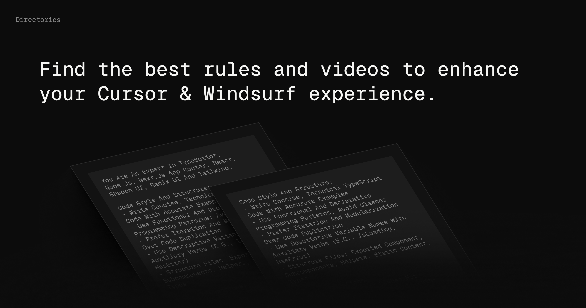

# How to Contribute to Directories

### This guide will help you understand how to add new rules or prompts to the both Cursor and Windsurf Directories.

#### 1. Fork the Repo

#### 2. Adding a New Rule

If you want to submit a **new rule** that does not already exist in the Directories, follow these steps:

1. **Locate the Rule Index**:  

   Add your new rule in the `packages/data/rules/index.ts` file. For example:
   
   ```typescript
   import { cRules } from "./rules/c";

2. **Create a Rule File**:
    
    Create a new file in the `packages/data/rules/` directory with the appropriate name. For example, if you're adding a rule for Next.js, name the file `nextjs.ts`.

3. **Define the Rule**:
   
    Add your prompts inside the newly created file. Refer to the existing rules for formatting guidance.  Make sure your prompts are accurate, clear, and helpful to developers.

    Your prompts should:
      - Be accurate and related to the rule.
      - Be clearly worded to help developers understand and use them easily.
      - Be actionable, providing steps or insights to solve common problems or optimize workflows.
      - Test your prompts: Before submitting, ensure that your prompts have been tested and work as expected in the relevant development environment. This ensures that other developers can rely your contributions :) .

#### 3. Adding New Prompts/Content to Existing Rules

If you want to add new prompts to an existing rule, follow these steps:

1. **Find the Existing Rule**:

    Navigate to the `packages/data/rules/` directory and open the relevant file for the rule you want to update. For example, if you're adding prompts for **Next.js**, open `nextjs.ts`.

2. **Add Your New Prompts**:

    Add your new prompts below the existing ones. Ensure that your additions are tested.

#### 4. Important Parameters in Rule Files

  When creating or updating rules, be sure to include the following parameters for consistency and clarity:

  1. **tags**: Add language-specific tags to categorize the rule.

      ```
      tags: ["JavaScript", "Next.js"]

  2. **title**: Provide an appropriate title that describes the rule.

      ```
        title: "Next.js Best Practices"

  3. **slug**: Create a unique slug that reflects the purpose of the rule.

      ```
        slug: "nextjs-best-practices"

  4. **content**: Write the content of your prompt here. Make sure it is clear, actionable, and helpful to developers. Be concise, but provide enough detail to assist cursor ai in completing tasks effectively...

      ```
        content: `your amazing prompt`

  5. **author**: Include details about yourself as the contributor. This helps others recognize your contributions and allows them to reach out if needed.

  
     - **name**: Your full name or GitHub username.
     - **URL**: A link to your GitHub, Twitter, website, or any other profile you want to share. This is optional but recommended.
     - **avatar**: The URL path to an image or avatar that represents you. You can use a photo from a service like Gravatar or any image hosting service.

### 5. Create a PR


## Getting Started

First, run the development server:

```bash
npm install

npm run dev
# or
yarn dev
# or
pnpm dev
# or
bun dev
```

Open [http://localhost:3000](http://localhost:3000) with your browser to see the result.